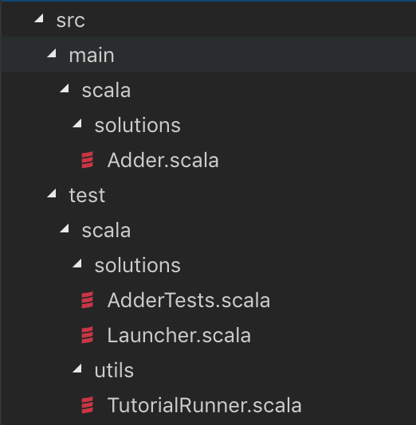

# 建立工程(for mac)
## 基于旧项目
1. 克隆chisel tutorial仓库  
    \$ git clone https://github.com/ucb-bar/chisel-tutorial.git  
    \$ cd chisel-tutorial  
    \$ git fetch origin  
    \$ git checkout release
2. brew install sbt verilator
3. 运行sbt run检查是否安装成功sbt，成功的输出消息会有success字样
4. 在仓库根目录下执行 sbt，会根据配置文件构建好chisel环境，会下载很多chisel和scala的包，需一些时间。
5. 验证chisel是否安装成功，在sbt环境里输入 test:runMain solutions.Launcher Adder   若出现success的字样，则说明安装成功。


## 构建新项目

1. 新建目录结构,把src目录下的硬件电路和tester放入相应位置,放入launch.scala与utils目录(launch.scala与TutorialRunner.scala都是复制来的)

<center>
    
    <br>
    <div style="color:orange; border-bottom: 1px solid #d9d9d9;
    display: inline-block;
    color: #999;
    padding: 2px;">文件目录结构</div>
</center>

2. 修改launch.scala,内容如下，修改相关变量为电路文件和测试文件的名字（我的例子里是Adder和AdderTests）

    ```scala
    package solutions
    import chisel3._
    import chisel3.iotesters.{Driver, TesterOptionsManager}
    import utils.TutorialRunner
    object Launcher {
      val tests = Map(
        "Adder" -> { (manager: TesterOptionsManager) =>
          Driver.execute(() => new Adder(8), manager) {
            (c) => new AdderTests(c)
          }
        }
      )
      def main(args: Array[String]): Unit = {
        TutorialRunner("solutions", tests, args)
      }
    }
    ```

3. 将build.sbt复制过来到根目录下
4. 命令行根目录下运行sbt命令，会报错并生成几个新目录，输入exit退出sbt，修改生成的project目录下的build.properties里的sbt.version为1.1.1
5. 大功告成，再次使用sbt指令不会报错了
   + test:runMain solutions.Launcher Adder 测试，
   + test:runMain solutions.Launcher Adder --backend-name verilator 生成verilog


